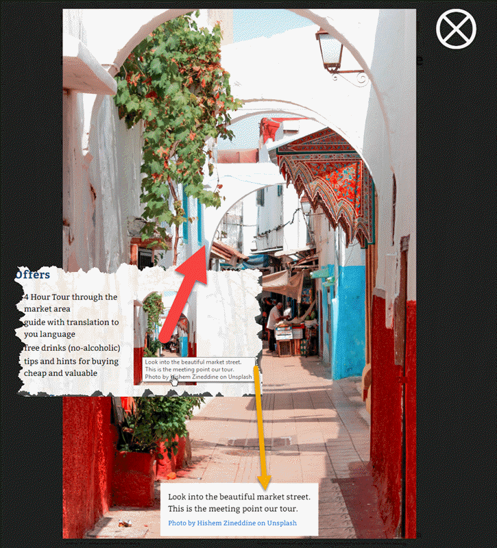

# Yellow Extension imgpop

Version 1.2.0 (requires YELLOW 0.8.4 or higher)

CSS only image popup for [Yellow](https://developers.datenstrom.se/de/help/ "see homepage of Yellow") with dimmed background and subtitle, no additional script required. If a JPG file is used the exif comment optionally can be shown.

## The Idea Behind

Typically "zoom functions" are realised with JavaScript and/or switching between a thumbnail image and a full size image. While I am optimising images *always* to achieve low traffic for users, an additional thumbnail in most cases is no advantage. Some css allows using a single image in *standard presentation* and full screen: 

> The css below is required to achieve this behaviour. You can add it to the standard css file and  alter it to your personal needs or preferences. 

The *standard presentation* is defined with the css as *aligned right, max-width 40% of textwidth*. This can be overridden by a class passed to the plugin.

The image pops up to it´s maximum size or — if too large for viewport — 90% width or 80% height aspect ratio kept.

## How do I Install This?

1. Download and install [Datenstrom Yellow CMS](https://github.com/datenstrom/yellow/).
2. Download [ImgPop plugin](https://github.com/BsNoSi/yellow-extension-imgpop/archive/master.zip ).  If you are using Safari, right click and select 'Download file as'.
3. Copy the `yellow-plugin-imgpop-master.zip` into the `system/plugins` folder.

> To uninstall, delete the extension and its additional files.

## How To Add A Popup Image?

> Small and big image are the same. This means, that calling the page, loads the full image, showing the full size needs no additional load. Therefore you should optimise your images to a suitable size. Big enough but as small as possible, to reduce required bandwidth. The image is limited to its true size with imgpop.css. You can alter this. Be aware, that small images zoomed to bigger than true size very seldom look nice.

Create a `[imgpop TheImage TheTitle TheID TheClass]` shortcut.

The following arguments are available:

`TheImage` = Filename and path (relative to `media/images` !) to the image, **required**     
`TheTitle` = The Title for the image as `title` tag and subtitle.     
`TheID` = The ID of the target. If missing, replaced by a timestamp (**not unique** if more than one image!).      

> You should *always* give an unique ID for the image if more than one `imgpop` is used on a page.

`TheClass` =  Optional css class to override the standard formatting (s. below).

Missing filename generates an error message: 

`<b style=\"color:#FF0000\">Image Source Missing!</b>` 

If *no title* is given to a jpeg file `imgpop` tries to display the exif comment of the file. An empty title is replaced by *No further description*. 

> You should change the German part to your standard language and leave the English part as fallback. If you have a multilingual website you can introduce the missing language by adding an `if…else` for it.

A found comment may contain html witch is stripped for the title label but used for the description of the zoomed image. 

**Be aware, that this may introduce unwanted/dangerous html code with uploaded jpg images**.  If you want to prevent this, uncomment `// $TheTitle = strip_tags…`. 

### Examples

`[imgpop portal/portal2.jpg]` → 

- Reads the image from `/media/images/portal/`
- Generates  a time based id
- Tries to read out the exif comment of the file

`[imgpop portal/portal2.jpg "A beautiful door." d1 left]` → 

- Reads  the image from `/media/images/portal/`
- Generates the class id `d1`
- Uses *regardless to an exif comment* the given title
- uses the css class `left`

`[imgpop portal/portal2.jpg - d1 left]` → 

- Same as previous exept that an exif comment is used, if available.

> [imgpop] without any parameter shows a bold parameter list in preview. If not bold you should check if imgpop is correctly installed.

ImgPop is licensed under the terms of the public license.

## Developer

[Norbert Simon](https://nosi.de)
