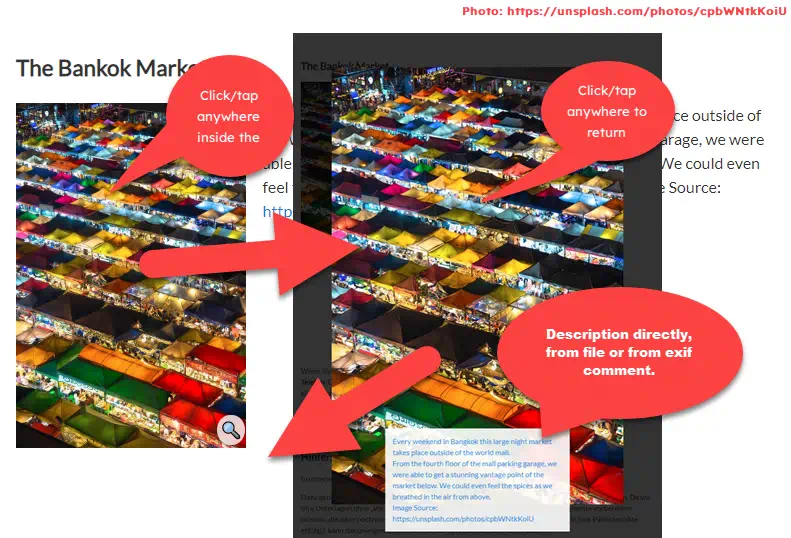

# Yellow Extension imgpop

Version 1.6.0 (requires YELLOW 0.8.4 or higher)

CSS only image popup for [Yellow](https://developers.datenstrom.se/de/help/ "see homepage of Yellow") with dimmed background and subtitle, no additional script required. Reads image comment from file or exif, if available.

## General Description

Typically "zoom functions" are realized with JavaScript and/or switching between a thumbnail image and a full size image. While I am optimizing images *always* to achieve low traffic for users, an additional thumbnail is typically no advantage. Some css allows using a single image for default and zoom view: 

Clicking or taping the *small* image it pops up to it´s maximum size or — if too large for viewport — 90% width or 90% height aspect ratio kept. The title of the *small* picture is set by default (see `imgpop.txt`) to »Please click for description«. The Title of the *large* picture can be set directly, fetched from a file `imagename.txt` in the same folder as the picture or from exif data (only jpeg images support this). 

The Extension comes with a prepared CSS-file that is added to the *footer* of a page *where imgpop ist used*. The *standard presentation*, passed as style "ipop" is defined with a maximum width of 30% for the *small* image. This can be overriden by additional styles or you may modify `imgpop.css` to your needs.

## How do I Install This?

1. Download and install [Datenstrom Yellow CMS](https://github.com/datenstrom/yellow/).
2. Download [ImgPop plugin](https://github.com/BsNoSi/yellow-extension-imgpop/archive/master.zip ).  If you are using Safari, right click and select 'Download file as'.
3. Copy the `yellow-plugin-imgpop-master.zip` into the `system/plugins` folder.

> Installation is »carefully« which means, that altered files (exept »imgpop.php«) are *not* replaced due to an update. To ensure that you get all current files, delete or rename all »imgpop…« files, before updating.

To uninstall, delete the extension and its additional files.

## How To Add A Popup Image

> Small and big image are the same. This means, that calling the page, loads the full image displaying it small. Showing the full size needs no additional load. Therefore you should optimize your images to a suitable size. Big enough but as small as possible, to reduce required bandwidth. Think about using "webp", which has a small file size, even with large image dimensions.      
> The image is limited to its true size with imgpop.css. You can alter this. Be aware, that small images that are zoomed larger than their actual size very rarely look beautiful.

Create a `[imgpop TheImage TheTitle TheID TheClass]` shortcut.

The following arguments are available:

| Argument | Description                                                  |
| :------: | ------------------------------------------------------------ |
| TheImage | Filename and path (relative to `media/images` !) to the image, **required**. A missing filename generates an error message. |
| TheTitle | The Title for the *large* image. If missing, first attempt is reading a file `imagename.tx`. If not available, second attempt is reading exif data (jpeg only). No title leads to standard entry `imgpop_NoTitle` preset in `imgpop.txt`. The *small* image *always* hat `imgpop_zoom` preset as title. |
|  TheID   | The ID of the target. If missing, replaced by the filename. If two images with the same filename (from different folders) are shown on the same page, this will always show the first image with the same name. To avoid this, you should prefer unique IDs. |
| TheClass | Additional class(es) to basic `impop` class for adding or overriding the preset. |

> All tags are stripped off from TheTitle except ` ` and ` `.

### Examples

`[imgpop portal/portal2.jpg]` → 

- Reads the image from `/media/images/portal/`
- Generates  `#portal2` as ID
- Tries to read `/media/images/portal/prtal2.txt`. If not found, tries to read the exif comment of `portal2.jpg`.

`[imgpop portal/portal2.jpg "A beautiful door." d1 fl]` → 

- Reads  the image from `/media/images/portal/`
- Sets id `#d1`
- Uses *regardless to an existing txt-file or exif comment* the given title
- adds css class `fl` (preset of `imgpos.css` → float left)

`[imgpop portal/portal2.jpg - d1 left]` → 

- Same as previous exept that content of txt file or exif comment is used, if available.

> [imgpop] without any parameter shows a bold parameter list in preview. If not bold you should check if imgpop is correctly installed.

ImgPop is licensed under the terms of the public license.

## History

2018-09-07: Initial Release

2019-04-23: Exif read for jpeg files, improved css

2019-12-08: Improved behavior, closer removed, magnifier symbol added

2020-01-07: Filename instead of timestamp as ID, text file for *large* title, default *small* title, Readme overhaul

## Developer

[Norbert Simon](https://nosi.de)